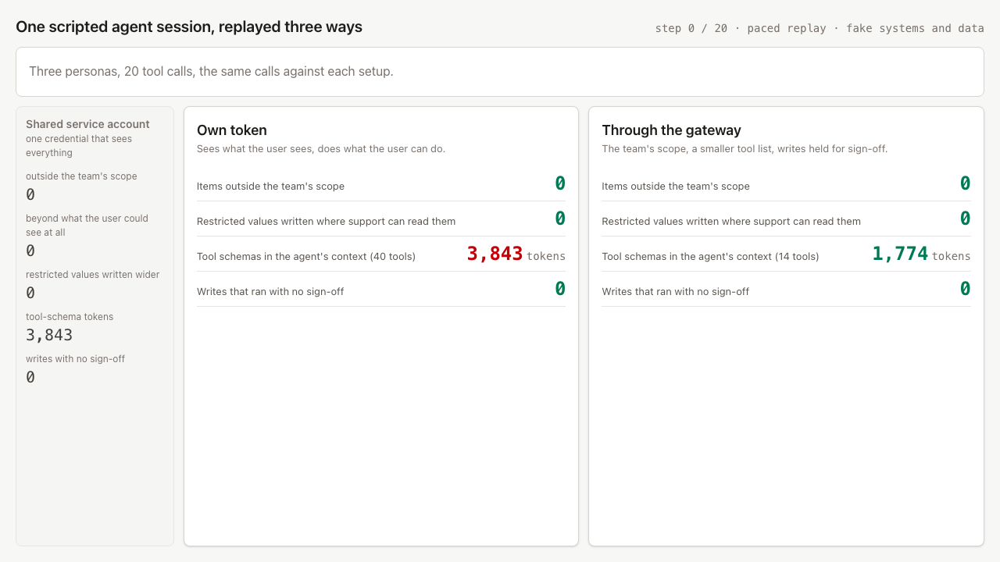

# gatehouse

By [Ahmed Sozzer](https://amsozzer.com) · [github.com/Amsozzer1](https://github.com/Amsozzer1)

A small MCP gateway that gives each team's agent less than its user could reach (pinned scope, held writes, a smaller tool list), compared with a shared service account and with per-user tokens on the same scripted session.

When a team connects an agent to company systems, the quick setup is one service account that sees everything. The careful setup is each person's own token, so the source system applies that person's permissions. That stops the agent seeing what the user can't, but the agent still gets everything the user can: a sales director using the EMEA team's agent pulls every region and the discount floors, the agent pastes those floors into a support ticket that support staff read, deals close with nobody signing off, and the agent carries 40 tool schemas it doesn't need. Every one of those calls is permitted. gatehouse sits between the agent and the systems, calls each system as the real user, and narrows what the team's agent can reach below that.



<!-- caption:start -->
*Paced replay of one scripted session (20 tool calls, no LLM; the systems and data are fake). Middle: the agent uses each person's own token. 137 items outside the EMEA team's scope reach it, 6 discount floors end up in a ticket comment that support can read, and 5 writes that the team's policy says need sign-off run without it. Right: the same calls through the gateway. 0 items outside the scope, 0 restricted values written, 4 writes held and 4 of them approved by the EMEA lead; 2 routine writes from the support bundle ran unsigned, as its policy allows. Left, muted: a shared service account, 304 items, 167 of them beyond what the user could see at all.*
<!-- caption:end -->

## Results

Measured by `pnpm measure` on seed 42: the same 20 tool calls against each setup, each on a fresh copy of the seed database, with every number computed by an independent permission oracle (see How it works). The counters are deterministic and CI re-measures them on every push. Apple M4, 16 GB, macOS, Node 24, Postgres 15.13.

<!-- results:start -->
| Agent connects through | Items outside the team's scope | of which beyond the user's own permissions | Restricted values written where more people can read them | Writes that skipped a sign-off the team's policy requires | Tool-schema tokens in the EMEA agent's context | Legitimate tasks fully served |
|---|---|---|---|---|---|---|
| Shared service account | 304 | 167 | 6 | 6 of 8 | 3843 | 14 of 16 |
| Per-user token | 137 | 0 | 6 | 5 of 7 | 3843 | 15 of 16 |
| **Through the gateway** | 0 | 0 | 0 | 0 of 6 | 1774 | 16 of 16 |

In every column, 2 routine support writes also ran unsigned, because the support bundle doesn't require sign-off for them; they are counted in the totals, not in the column.
<!-- results:end -->

<!-- summary:start -->
What the gateway costs: 12 of the 16 legitimate calls had something pinned or held (region pinned, row limit clamped, fields removed, or a write held for sign-off), and 16 of 16 still got everything the task needed, checked against what the oracle says each task needs.

Seeds 1 to 5 give the same picture: per-user tokens leave 115 to 136 items outside the team's scope and write 6 restricted values wider; the gateway leaves 0 and 0, and serves 16 of 16 legitimate tasks on every seed.

The gateway hop adds 0.3 ms at the median and 0.62 ms at p95 to one read call (0.32 ms direct vs 0.62 ms through the gateway; 5 runs of 1000 calls, one machine, loopback).
<!-- summary:end -->

A task counts as fully served when the agent got every record the task needs, or for totals exactly the team's total. The per-user token misses one because the director's pipeline total covers every region, not the EMEA team's.

Full numbers and how each was produced: [`results/numbers.md`](results/numbers.md).

## How it works

```
agent ──MCP──> gateway /mcp/<team bundle> ──MCP, with the user's own token──> CRM, ticket desk (mock)
                 1. tool in the team's bundle? otherwise blocked
                 2. pin region, row limit and fields, so the source returns only the team's scope
                 3. write that needs sign-off? dry-run it as the user, then hold it
                 4. otherwise call the source as the user, so its own permissions apply
                 5. one audit row per call (Postgres)
```

- **Two mock systems** (`packages/systems`): a CRM and a ticket desk, each an MCP server over Streamable HTTP. Each has its own permission model, enforced in SQL when a call comes with a user token: CRM territories, a reporting hierarchy, and a discount floor hidden from reps; ticket projects. The 40 tools are generated CRUD plus four hand-written ones.
- **One policy file** (`policy.yaml`): per team, the members, the tools, the scope the team's agent should see, the parameters the gateway pins to get there, and which writes need sign-off from whom. A bad reference fails at startup.
- **The gateway** (`packages/gateway`) never filters results after the fact. It pins parameters the source honours and lets the source do the filtering, because filtering afterwards gets totals, row limits and nested records wrong. Held writes run later, once, as the requester, with an approval id the source only accepts from the approval executor.
- **Observe mode** runs the same checks, logs what it would have blocked, clamped or held, and changes nothing. That is the first week for a new team; see Run it.
- **The oracle** (`packages/oracle`) decides what counts as a leak. It re-implements both systems' permission rules in plain TypeScript, separately from the SQL, and reads only the `scope:` block of the policy, never the parameters the gateway pins. A property test checks it agrees with the SQL for all 16 generated users on every read tool.
- **The runner** (`packages/runner`) replays `traces/session.yaml` against each setup. Tasks pick records by attributes from the seed data, and each legitimate task declares what it needs, so the oracle can check the gateway didn't break it.

Design decisions, and what went wrong on the way: [`docs/design-notes.md`](docs/design-notes.md).

## Run it

```sh
# requirements: Node 24, pnpm 12, Postgres 15 (Docker, or any local Postgres with DATABASE_URL set)
docker compose up -d          # Postgres on localhost:54329
pnpm install
pnpm seed                     # build the seed template database
pnpm test                     # unit, property and end-to-end tests
pnpm measure                  # every number above, into results/ and this README
pnpm dev                      # replay page at http://localhost:3000
```

Try one setup at a time, or run the stack and talk to it with any MCP client:

```sh
pnpm trace --target user                  # per-user tokens
pnpm trace --target gateway               # through the gateway, held writes approved as the EMEA lead
pnpm stack                                # systems and gateway on fixed ports, prints persona tokens
pnpm approve <id> --as approver           # approve a held write on that stack
```

**Rolling this out for one team.** Start the team on `pnpm stack --observe`: their agent gets the full tool list and every call goes through unchanged, while the audit log records what would have been blocked, clamped or held. Review that with the team lead (<!-- rollout:start -->for the EMEA sales agent in this session: 1 call to a tool outside the bundle, 8 calls pinned to EMEA, 5 calls with fields removed, 1 call with the row limit clamped, 4 calls that would wait for sign-off, and 1 call the CRM would refuse anyway<!-- rollout:end -->), adjust `policy.yaml`, then switch to enforce. The query behind the report is in `scripts/measure.ts`. Observe mode shows the same checks firing on real calls; it does not predict exactly what enforce mode would return, because unpinned reads can lead to different later calls.

Optional: `pnpm seeds` (seeds 1 to 5), `pnpm latency` (gateway hop), and `pnpm record` to re-render `docs/demo.gif` (needs ffmpeg and `npx playwright install chromium`).

## Named assumptions

- Each source system enforces its own permissions when called with a user's token. The gateway relies on that and doesn't re-implement it.
- The gateway can get a token for each user on each system. Here that is a seeded table; in practice it is admin-authorized impersonation or token exchange.
- A team's scope can be expressed as parameters the source honours (region, row limit, fields). A test calls every read tool in both bundles with those parameters and checks the source honours them.
- Team membership and approvers come from identity-provider groups, seeded here.

## Honest limits

- **Everything is fake.** The systems, people, deals and tickets are synthetic, generated with a seeded faker. The permission models are loosely modelled on how CRMs and ticket desks share records; they are not copies of any real product's rules. The tool catalog is generated.
- **The session is scripted.** There is no LLM in the main path; each step is the call a broadly prompted agent would make. I wrote both the session and the policy, so the policy was written from each team's job, and a task counts as legitimate if the team does it in its normal work. The labels are in `traces/session.yaml`.
- **Zero leaks beyond the user's own permissions** in the per-user and gateway columns comes from the source systems' enforcement, not from the gateway.
- **Restricted values are caught when copied as written.** A floor that was rounded or paraphrased into a comment would not be counted.
- **Approvals don't notice a record changing** between hold and approve. The write runs against whatever is there.
- **The gateway caches its upstream connection per user**, so an identity change needs a restart to take effect.
- Token counts use js-tiktoken's cl100k encoding as a proxy for what any given model would count. Latency is on one machine over loopback; a real network dominates it.

## What I'd do next

- Hold writes to a wider audience after the session has read a restricted field, so paraphrased values are caught too.
- Version approvals: hold with the record's version, mark stale if it changed, and show the approver a diff fetched with their own access.
- Real token exchange with short-lived tokens, refreshed before slow approvals.
- The path for sources that only offer a service account: sync their permissions, filter with them, and measure the staleness window.
- Drive the same session with a real model, to see which calls it actually makes against a 14-tool bundle instead of 40.

## License

MIT
